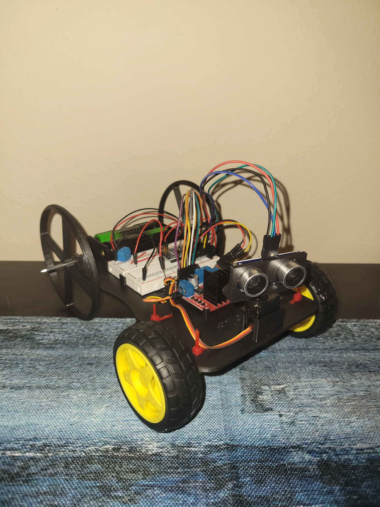

# Ultrasonic Rover
#### This project utilizes an ultrasonic sensor, servo motor, and an Arduino Nano microcontroller to create an obstacle avoiding rover called Cornelius. Included are STL files for 3D printing, an LTspice schematic for wiring visualization, and an image of the built rover. The project is divided into Mechanical, Electrical, and Programming sections for clarity.

--- 

### Image of Rover:


---

### Mechanical:
The chassis is custom-designed, and the wheels are inspired by a design from Prof. Wolken at Irvine Valley College. I resized the wheels and adjusted the spoke radii to suit my design.
* Printing: Chassis and wheels were 3D printed with PLA.
* Chassis Features:
  * Holes for zipties to secure the motors and components
  * Holes for routing TT motor wires to the motor driver
  * Bracket for the servo motor (slightly loose—use tape or a small shim for tightness)
* Wheels:
  * Front wheels mounted to motors with zipties
  * Rear wheels attached via two nails through a mounting bracket
* Component Mounting: Breadboard, motor driver, and battery holder secured with tabs on the chassis
* Ultrasonic Sensor: Custom bracket (found online) reinforced with screws and washers for stability
* Servo Motor: MG90 (metal gears, overkill for this project—an SG90 or similar plastic gear servo works fine)
* Notes: Some wheel wobbling may occur, especially during extended operation
---

### Electrical:
The rover is powered by two 18650 LiPo batteries in series (nominal 3.7 V each, 7.4 V total).
* Voltage Considerations:
  * Arduino Nano VIN: 7–14 V
  * MG90 servo: up to 12 V
  * Actual battery voltage ~8 V; sufficient for this setup
* Motors: TT motors (3–6 V); voltage drop across the motor driver brings them into the safe range
* Logic Power:
  * Arduino Nano and L298N motor driver have built-in 5 V regulators
  * 5 V from Nano powers both the HC-SR04 ultrasonic sensor and the MG90 servo
* Capacitor: 470 µF across power rail and GND smooths voltage spikes
* Wiring: Dupont jumper wires were used. Ensure solid connections to avoid intermittent
failures
* Current Draw: Realistically, total current should not exceed 2 A or get close.

#### Circuit Schematic: 


---

### Programming: 
The code is functional but can be optimized to reduce load on the Nano. It uses multiple `.cpp` files with a header file.
* **Compilation:** Arduino CLI (Linux tested)
* **Arduino IDE:** Should also work, though you may need to include all files manually
* **Shell Script:** Provided (`run.sh`) to simplify execution. Ensure it has executable permissions (`chmod +x run.sh`)

### Movement Logic:

| Movement   | IN1 | IN2 | IN3 | IN4 | ENA | ENB |
|------------|-----|-----|-----|-----|-----|-----|
| Forward    | 1   | 0   | 1   | 0   | PWM | PWM |
| Backward   | 0   | 1   | 0   | 1   | PWM | PWM |
| Turn Left  | 0   | 1   | 1   | 0   | PWM | PWM |
| Turn Right | 1   | 0   | 0   | 1   | PWM | PWM |
| Stop       | 0   | 0   | 0   | 0   | 0   | 0   |

**0 = Low**\
**1 = High**\
**PWM = 0-255 (analog), LOW or HIGH (digital)**

---

### How to run: 

### 1. Find Connected Serial Port
#### On Linux
```bash
ls /dev/tty*
```   

#### With Arduino CLI (recommended method)
```bash
arduino-cli board list
```

### 2. Run the program in CLI
```bash
./run.sh
```


